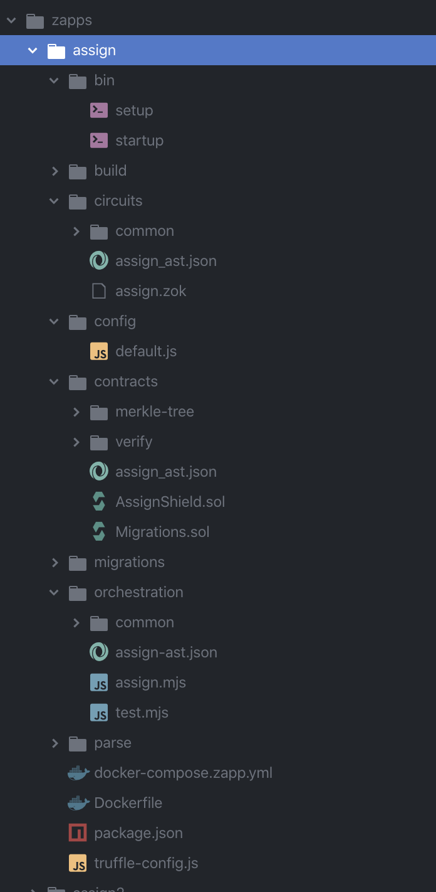

# zappify :zap:

Generate a zApp from a Solidity contract.

---

## Induction :zap:

zApps are zero-knowledge applications. They're like dApps (decentralised applications), but with privacy. zApps are tricky to write, but Solidity contracts are lovely to write.

- Write a Solidity contract
- Add a few new privacy decorators to the contract (to get a 'zappable' Solidity contract)
- Zappify that baby
- Get a fully working zApp in return

Solidity Contract > zappable Solidity Contract > zappify > zApp

### Overview

From the user's perspective, they write a 'normal' smart contract, like this one:

```
// SPDX-License-Identifier: CC0

pragma solidity ^0.7.0;

contract Assign {

  uint256 private a;

  function assign(uint256 value) public {
    a = value;
  }
}

```
Then add decorators to tell the compiler which variables they want to keep secret:
```
// SPDX-License-Identifier: CC0

pragma solidity ^0.7.0;

contract Assign {

  secret uint256 private a;

  function assign(secret uint256 value) public {
    a = value;
  }
}

```
They run `zappify -i <path/to/file>` and get an entire standalone zapp in return:



Easy!

(Not for us though...)

### Compiler

To `zappify`, the compiler must take the decorated solidity file (a `.zsol` file) and complete the following (simplified) steps:
-   **parse**, takes the `zsol` code and analyses it
-   **transform**, changes the code into an abstract syntax tree (AST)
-   **transform** (again*), changes that AST into our special purpose ASTs
-   **generate code**, generates code for the output zApp

\* *since we are taking already working code and converting it into more working code of different language(s), this is technically a transpiler, not a compiler*

#### Parse

In this case, when we first transform the `.zsol` file into an AST, we're actually using `solc` to compile it as if it were a normal `.sol` file. However, `solc` would throw a hundred errors at us if we kept the special decorators like `secret` in there.

So the parsing stage (unlike a 'normal' compiler) looks through the code line by line and identifies decorators. It removes those decorators, saving their place, to output a working `.sol` file. We can then use `solc compile` to get a nice, ready-made Solidity AST! Here's a (very abridged) version of what the AST for the above example looks like:

```json
{
    "absolutePath": "input",
    "id": 15,
    "license": "CC0",
    "nodeType": "SourceUnit",
    "nodes": [
        {
            "id": 1,
            "literals": [
                "solidity",
                "^",
                "0.7",
                ".0"
            ],
            "nodeType": "PragmaDirective",
        },
        {
            "contractKind": "contract",
            "id": 14,
            "name": "Assign",
            "nodeType": "ContractDefinition",
            "nodes": [
                {
                    "id": 3,
                    "mutability": "mutable",
                    "name": "a",
                    "nodeType": "VariableDeclaration",
                    "stateVariable": true,
                    "visibility": "private",
                },
                {
                    "body": {
                        "id": 12,
                        "nodeType": "Block",
                        "statements": [
                            {
                                "expression": {
                                    "id": 10,
                                    "leftHandSide": {
                                        "id": 8,
                                        "name": "a",
                                        "nodeType": "Identifier"
                                    },
                                    "nodeType": "Assignment",
                                    "operator": "=",
                                    "rightHandSide": {
                                        "id": 9,
                                        "name": "value",
                                        "nodeType": "Identifier",
                                    },
                                },
                                "id": 11,
                                "nodeType": "ExpressionStatement",
                            }
                        ]
                    },
                    "id": 13,
                    "kind": "function",
                    "name": "assign",
                    "nodeType": "FunctionDefinition",
                    "parameters": {
                        "id": 6,
                        "nodeType": "ParameterList",
                        "parameters": [
                            {
                                "id": 5,
                                "name": "value",
                                "nodeType": "VariableDeclaration",
                            }
                        ],
                    },
                    "returnParameters": {
                    },
                }
            ],
        }
    ],
}
```

This is the JSON way of saying:


