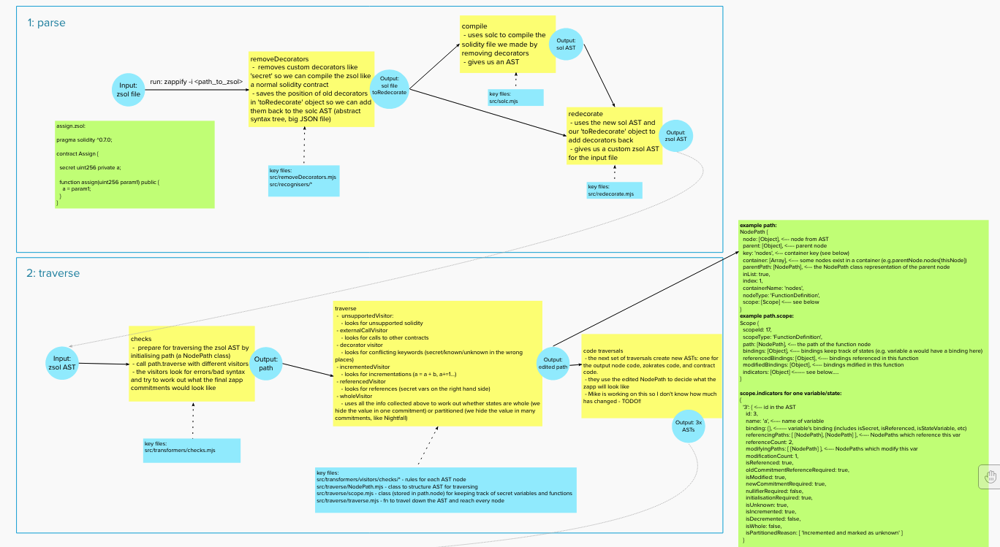

# zappify :zap:

Generate a zApp from a Solidity contract.

---

## Induction :zap:

zApps are zero-knowledge applications. They're like dApps (decentralised applications), but with privacy. zApps are tricky to write, but Solidity contracts are lovely to write.

- Write a Solidity contract
- Add a few new privacy decorators to the contract (to get a 'zappable' Solidity contract)
- Zappify that baby
- Get a fully working zApp in return

Solidity Contract > zappable Solidity Contract > zappify > zApp

### Overview

From the user's perspective, they write a 'normal' smart contract, like this one:

```
// SPDX-License-Identifier: CC0

pragma solidity ^0.7.0;

contract Assign {

  uint256 private a;

  function assign(uint256 value) public {
    a = value;
  }
}

```
Then add decorators to tell the compiler which variables they want to keep secret:
```
// SPDX-License-Identifier: CC0

pragma solidity ^0.7.0;

contract Assign {

  secret uint256 private a;

  function assign(secret uint256 value) public {
    a = value;
  }
}

```
They run `zappify -i <path/to/file>` and get an entire standalone zapp in return:


Easy!

(Not for us though...)

### Compiler

To `zappify`, the compiler must take the decorated solidity file (a `.zsol` file) and complete the following (simplified) steps:
-   **parse**, takes the `zsol` code and analyses it
-   **transform**, changes the code into an abstract syntax tree (AST)
-   **transform** (again*), changes that AST into our special purpose ASTs
-   **generate code**, generates code for the output zApp

\* *since we are taking already working code and converting it into more working code of different language(s), this is technically a transpiler, not a compiler*

#### Parse

In this case, when we first transform the `.zsol` file into an AST, we're actually using `solc` to compile it as if it were a normal `.sol` file. However, `solc` would throw a hundred errors at us if we kept the special decorators like `secret` in there.

So the parsing stage (unlike a 'normal' compiler) looks through the code line by line and identifies decorators. It removes those decorators, saving their place, to output a working `.sol` file. We can then use `solc compile` to get a nice, ready-made Solidity AST! [Here](doc/littleast.json)'s a (very abridged) version of what the AST for the above example looks like.

This is the JSON way of saying:


The parsing stage has saved all the locations of special `zsol` decorators for us. So the above `dedecoratedAST` can be `redecorated`. We turn a secret variable node from something like:
```json
{
    "id": 3,
    "mutability": "mutable",
    "name": "a",
    "nodeType": "VariableDeclaration",
    "stateVariable": true,
    "visibility": "private",
}
```
To:
```json
{
    "id": 3,
    "mutability": "mutable",
    "name": "a",
    "nodeType": "VariableDeclaration",
    "stateVariable": true,
    "visibility": "private",
    "isSecret": true,
}
```
For each decorated variable, statement, parameter, and function. This output `zsol` AST is then *traversed*.

#### Transform

Now onto the transform (again) step, we look at every node in the custom `zsol` AST and collect all the information we need for our zApp. Which variables are secret? How many functions are there? What should our commitments look like? Has the user written something really stupid?

This step answers those questions, and more, with the magic of *traversals*. Each traversal takes us through the entire AST and stores information based on certain rules. In later traversals, we gradually build up new ASTs which represent output zApp code by traversing the `zsol` AST.

For now, lets look at the initial traversals, which check for errors and find secrets.

Before traversing:

-   Initialise `path` - a `NodePath` class which represents the whole AST and has a ton of useful associated methods
-   Initialise `scope` at `path.scope` - another class, `Scope`, which keeps track of states and logs all their edits and references throughout the `zsol` contract
-   Import and 'explode' visitors - visitors contain rules for traversing, separated by `NodeType` (e.g. do this when we find a `VariableDeclaration` node)

Then we call: `path.traverse(explode(visitor))`.

The `traverse` method tells us which order to visit nodes in.

For example, a `VariableDeclaration` node will have no children, so we must go back up the tree until we find a node with a sibling we haven't visited. Meanwhile, a `FunctionDefinition` node has children in three categories (or containers); `parameters`, `returnParameters`, and `body`. The traverse method knows to visit parameters first, since that tells us what variables will be used in the function, then move back up and visit the other children.

Using the `path` and `scope` objects, we fill in indicators for each secret state. These include:

-   `isSecret` - whether the user marked this variable as secret
-   `isModified` - whether the state has been modified in the contract
-   `isConsulted` - whether the state has been referenced to in assigning a new state
-   `isIncremented` - whether the state has been incremented e.g. `a += value`
-   `isWhole` - whether the state will be hidden in one commitment, which is overwritten each time it's edited or...
-   `isPartitioned` - whether the state will be hidden in lots of commitments, like Nightfall

We also have variable indicators at the function scope level, such as `oldCommitmentReferenceRequired` and `nullifierRequired`. Secret states might need to be nullified in one function(e.g. Nightfall burn), but not another (e.g. Nightfall mint).

Below is a flow guide up to this step!



#### Code Generation

`TODO`

### What we done did so far

#### Commitment structure
#### State variable IDs
#### Whole vs Partitioned states
##### Limitations
##### Identification
##### Examples

#### Ownership
##### Partitioned states
##### Whole states

#### Sharing private data
